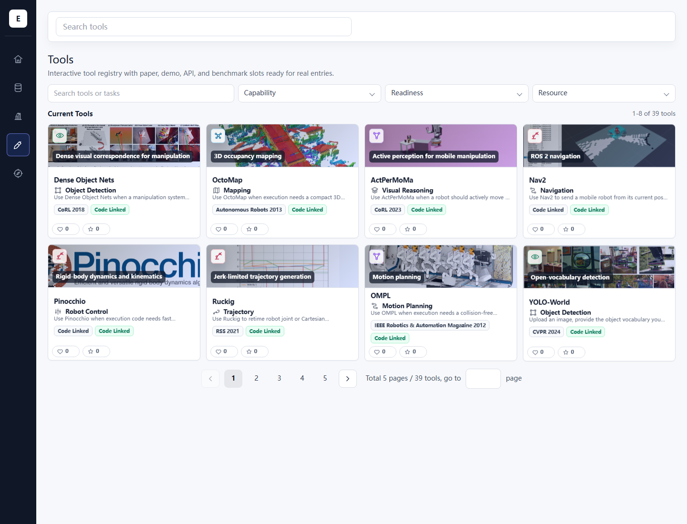
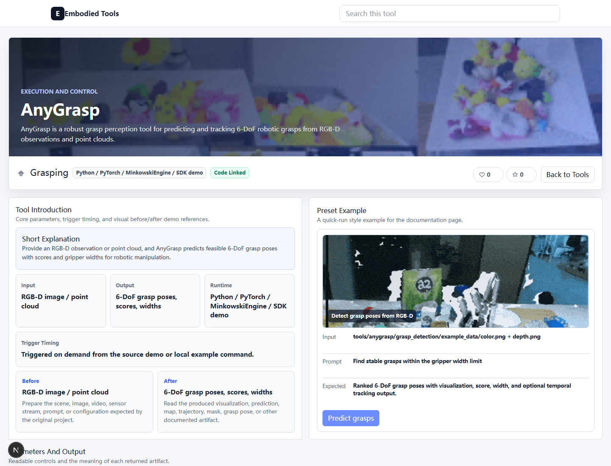

# Embodied Tools

An interactive embodied-intelligence tool hub for browsing, comparing, and documenting manipulation and robotics tools.

[Live demo](https://racingemperor.github.io/manip-tool-hub/) | [GitHub repo](https://github.com/racingemperor/manip-tool-hub)

## What It Does

- Browse a searchable tool catalog with capability filters, readiness filters, resource filters, and pagination.
- Open a tool detail page to inspect the hero image, task summary, input/output contract, preset example, parameter notes, benchmark rows, and official resource links.
- Compare tools across perception, cognition, reasoning, planning, and execution.
- Ship as a static site so new entries can be added by editing typed data files instead of hand-wiring pages.

## Quick Start

```bash
git clone https://github.com/racingemperor/manip-tool-hub.git
cd manip-tool-hub
npm install
npm run dev
```

Open `http://localhost:3000/tools`.

Build the static site:

```bash
npm run build
```

The export is written to `out/` and is ready for GitHub Pages.

## Technical Details

- `app/` - App Router pages for the home view, datasets, leaderboard, tools index, and tool detail routes.
- `components/` - Reusable UI blocks for shells, filters, cards, search, galleries, and detail layouts.
- `data/` - Typed content source for tools, datasets, leaderboard rows, and supporting metadata.
- `lib/` - Shared helpers for asset paths, capability labels, search, and tool-document generation.
- `public/assets/tools/` - Source figures, demos, and media for individual tools.
- `public/assets/readme/` - Real screenshots used in this README.
- `public/tool.html` - Legacy/static demo entry point kept alongside the Next.js app.

To add a tool, create a new entry in `data/tools.ts`, place the media under `public/assets/tools/<slug>/`, and add benchmark rows only when the source paper reports real numbers.

## File Structure

```text
app/
  page.tsx
  datasets/page.tsx
  leaderboard/page.tsx
  tools/page.tsx
  tools/[slug]/page.tsx
components/
data/
lib/
public/
  assets/
    tools/
    readme/
```

## Real Screenshots

### Tool Catalog



The catalog shows searchable filters, capability grouping, readiness flags, and cards for each tool.

### Tool Detail



The detail page shows the tool's hero banner, input/output summary, preset example, parameters, and source links.
